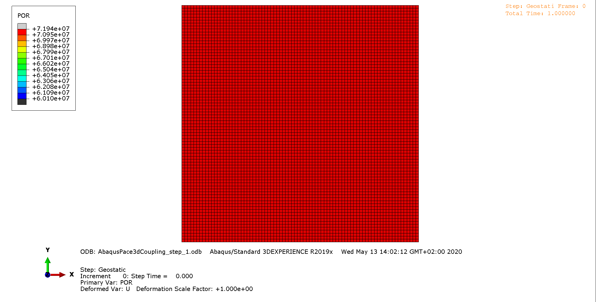

# Sample for partial coupling of two engines

> This sample shows the use of this framework as a `partial coupling`. 
> A geomechanical `Simulia Abaqus Standard 2D` simulation and a hydrological `Pace3D` simulation are partially coupled.
> Coupling parameters are the pore pressure (output of Pace3D and input for Abaqus) and void ratio (output of Abaqus and input to Pace3D).
> Each iteration step the coupling parameters are exchanged between the two simulation engines.

> This sample uses the same Simulia Abaqus model as [abaqus-self_2D_sample](abaqus-self_2d_sample) and [abaqus-self_subroutine_2D_sample](abaqus-self_subroutine_2d_sample).
---

## Requirements

 - Simulia Abaqus Standard Engine
 - Simulia Abaqus Standard Subroutine Environment
 - Pace3D pore pressure distribution files (included in [input folder](input))

## Description/Usage

> Specific information about the Simulia Abaqus input file and creating boundary conditions can be found in Abaqus pseudo coupling samples ([abaqus-self_2D_sample](abaqus-self_2d_sample); [abaqus-self_subroutine_2D_sample](abaqus-self_subroutine_2d_sample)).

An initial void ratio and pore pressure distribution are defined and used as an initial input for Pace3D and Simulia Abaqus Standard (Abaqus).
Initial pore pressure distribution is loaded from data file [`input/pace3D_pore_pressure_initial.dat`](input/pace3D_pore_pressure_initial.dat) and stored in a Grid object in Pace3D engine for the step named ``initial``.
This distribution is transferred into Grid object int Abaqus engine and finally used to create boundary conditions for Abaqus simulation (input file).
An input file for Simulia Abaqus will be written and and stored in the specified output path ``output/step_initial/AbaqusPace3dCoupling_initial``.
A bash file for this iteration step's simulation is created and stored at the same place as the input file and will be run.
The Python's subprocess library calls the bash file and keeps the focus on the simulation until it ends.

After each iteration in the Simulia Abaqus Standard simulation the actual void ratio distribution is exported into a csv file by a user subroutine.
This file contains the deformed mesh coordinates and the corresponding void ratio.
These information are imported into a new grid and transferred into Abaqus engine Grid object for the step named ``initial``.

The void ratio distribution is transformed to Pace3D engine Grid object for the step named ``initial``.
Some Pace3D simulation stuff can/will be done next and a pore pressure distribution will be stored in a dat file.
This distribution is loaded into the Grid object.  
Here ends the initial iteration step.

The upcoming steps (in this case only one) are establishes as follows:
In General a new step is created in the SimulationHandler object with a specific name, here it is step_x.
The pore pressure results from the Pace3D simulation, already stored in the Pace3D engine's Grid object will be transformed to Abaqus engine's Grid object.
This distribution will be used to create new pore pressure boundary conditions for the Abaqus simulation.
According to the new boundary conditions a new Abaqus input file and bash file is created and the simulation is started.
To continue a previous simulation Abaqus needs the files of this simulation in exact the same folder as the actual simulation.
While the simulation is running those files are stored in the same folder and deleted afterwards.
From Abaqus exported void ratio distribution is imported and stored in Abaqus engine's Grid object for the step named ``step_x``.
Subsequently Pace3D simulation is prepared.
Void ratio is transformed from Abaqus engine Grid object to Pace3D Grid object and stored in step ``step_x``.
Pace3D simulation can be started and new pore pressure distribution will be imported into the Pace3D Grid object.

> In this particular case only the initial pore pressure distribution and one subsequent iteration step  with Pace3D was performed in advance.
> Therefore this coupling shows only the possibility to couple to different engines.
> Only the Abaqus engine is completely integrated and can be controlled by the UCSI so far.   

---

## Results

Here you can see a summary of the two iteration steps and the changing pore pressure.

---

## Workflow

 1. Set root path
 2. Start logging
 3. Set simulation's name
 4. Initialize SimulationHandler object
 5. Add Engine Handler object to SimulationHandler object that cares about Abaqus engine.
 6. Add Engine Handler object to SimulationHandler object that cares about Pace3D engine.
 7. Set paths and files to Abaqus engine
 8. Set paths and files to Pace3D engine
 9. Set number of steps
 10. Set name of part to be modified in Abaqus engine
 11. Prepare first step: set step name; add step to Simulation Handler object; copy grid from Abaqus input file into Grid object; import initial Pace3D pore pressure distribution into Grid object and transform to Abaqus Grid object; create initial boundary conditions for pore pressure in Abaqus with distribution store in Abaqus Grid object; create input file; create bash file;
 12. Run initial iteration step of Abaqus simulation
 13. Run initial iteration step of Pace3D simulation
 14. Iterate through following steps: 
 15. General: set step name; add step to Simulation Handler object; 
 16. Abaqus: read pore pressure from previous Pace3D step, transform and store for new step; create boundary conditions for input file; create Abaqus input file; create bash file; run simulation step; read and store void ratio into Abaqus engine's Grid object;
 17. Pace3D: read void ratio from previous Pace3D step, transform and store for new step; do some stuff; run simulation step; read and store pore pressure into Pace3D engine's Grid object;

