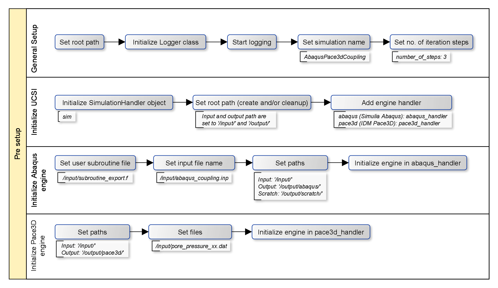
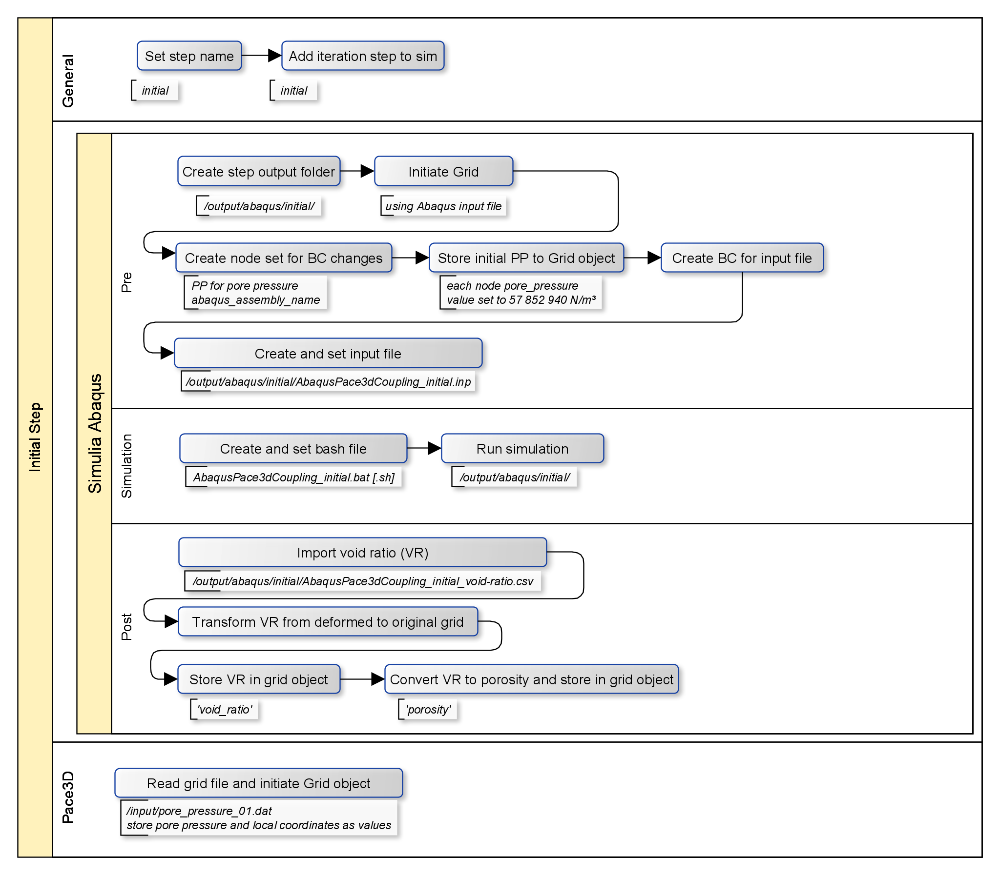
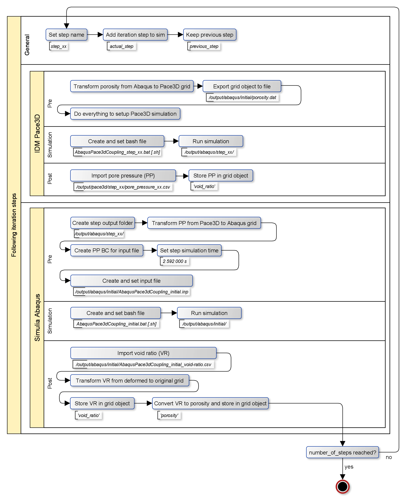

# Sample for partial coupling of two engines

> This sample shows the use of this framework as a `partial coupling`. 
> A geomechanical `Simulia Abaqus Standard 3D` simulation and a hydraulic `Pace3D` simulation are partially coupled.
> This simulation coupling is similar to [abaqus-pace3d_2D_sample](abaqus-pace3d_2d_sample), but the model in this sample is three dimensional.
> Coupling parameters are the pore pressure (output of Pace3D and input for Abaqus) and void ratio (output of Abaqus and input to Pace3D).
> Each iteration step the coupling parameters are exchanged between the two simulation engines.

> This sample uses the same model as [abaqus-self_3D_sample](abaqus-self_3d_sample).
---

## Requirements

 - Simulia Abaqus Standard Engine
 - Simulia Abaqus Standard Subroutine Environment
 - Pace3D pore pressure distribution files (included in [input folder](input))

## Description/Usage

> Specific information about the Simulia Abaqus input file and creating boundary conditions can be found in Abaqus pseudo coupling samples ([abaqus-self_2D_sample](abaqus-self_2d_sample); [abaqus-self_subroutine_2D_sample](abaqus-self_subroutine_2d_sample)).

An constant initial void ratio (25 %) and pore pressure distribution are defined and used as an initial input for Pace3D and Simulia Abaqus Standard (Abaqus).
Initial pore pressure distribution is set to a constant value (57,852,940 N/m²) and stored in a Grid object in Abaqus engine for the step named ``initial`` and is finally used to create boundary conditions for Abaqus simulation (input file).
An input file for Simulia Abaqus will be written and and stored in the specified output path ``output/step_initial/AbaqusPace3dCoupling_initial``.
A bash file for this iteration step's simulation is created and stored at the same place as the input file and will be run.
The Python's subprocess library is used to call the bash file and keeps the focus on the simulation until it ends.

After each iteration in the Simulia Abaqus Standard simulation the actual void ratio distribution is exported into a csv file by a user subroutine.
This file contains the deformed mesh coordinates and the corresponding void ratio.
These information are imported into a new grid and transferred from the deformed mesh into the initial mesh into Abaqus engine Grid object for the step named ``initial``.

Finally the Grid object for the Pace3d engine is initialized.
Note that Abaqus and Pace3d are using two different kinds of coordinate systems.
Compared to Abaqus the coordinate system in Pace3d is rotated and is the origin is shifted.
To transform data between the two Grid objects those differences have to be removed.
This can be done by the Grid object itself, but in this case the coordinates are both saved in a dat file which can be used as an input for the Grid object.
The coordinates corresponding to Abaqus are used as Node object coordinates.
For each node the rotated and shifted coordinates are saved as values (``local_x``, ``local_y`` and ``local_z``). 

Here ends the initial iteration step.

The upcoming steps are established as follows:
1. General stuff
2. Pace3d engine
3. Simulia Abaqus engine

### General Stuff

In general a new step is created in the SimulationHandler object with a specific name, here it is step_x.

### Pace3D Engine

Void ratio is converted into a porosity distribution and is transformed to Pace3D engine Grid object for the step named ``step_x``.
Some Pace3D simulation stuff can/will be done next and a pore pressure distribution will be stored in a dat file.
This distribution is loaded into the pace3D engine's Grid object.  

### Simulia Abaqus Engine

The pore pressure resulting from the Pace3D simulation, already stored in the Pace3D engine's Grid object will be transformed to Abaqus engine's Grid object.
This distribution will be used to create new pore pressure boundary conditions for the Abaqus simulation.
According to the new boundary conditions a new Abaqus input file and bash file is created and the simulation is started.
To continue a previous simulation Abaqus needs the files of this simulation in exact the same folder as the actual simulation.
While the simulation is running those files are stored in the same folder and deleted afterwards.
From Abaqus exported void ratio distribution is imported and stored in Abaqus engine's Grid object for the step named ``step_x``.

> In this particular case only the initial pore pressure distribution and three subsequent iteration steps were performed.
> Therefore this coupling shows only the possibility to couple to different engines.
> Only the Abaqus engine is completely integrated and can be controlled by the UCSI so far. 

---

## Results

Here you can see a summary of the four iteration steps and the changing pore pressure and void ratio.
")

---

## Workflow

The coupled simulation cna be split up into three parts:

 1. Pre configuration to initialize engines
 2. Run an initial simulation with both engines
 3. Run a couple of following iterations
 
 A detailed Explanation of each part can be found in the following charts.

 