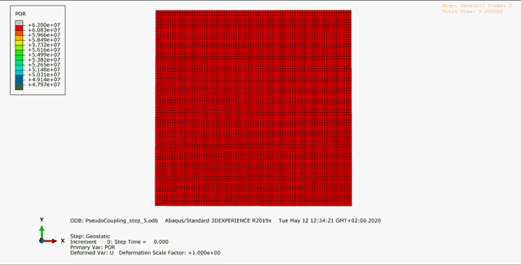

# Sample for a pseudo coupling


> This sample shows the use of this framework to set up a `pseudo coupling`. 
> Pore pressure boundary conditions of a `Simulia Abaqus Standard 2D` simulation are changed depending on an external function each iteration step.
> External function to change pore pressure values in this case, is a randomize function included in this framework.
> It can be useful for test purposes, while developing a new engine for this framework. 

## Requirements

 - Simulia Abaqus Standard Engine

## Description/Usage

Simulia Abaqus simulations are controlled by an input file (.inp).
These input files contain any information necessary to run a simulation: mesh; partitioning; material parameters; loads; contacts; step dependent information; output parameters.
The Abaqus engine extracts the mesh from the input file ``input/abaqus_pseudo_coupling.inp`` and stores it in a grid object.
This grid object is bound to a specific iteration step and can be modified/changed each iteration. 
In this sample the pore pressure is changed at each step.

To modify the Simulia Abaqus input file some extra entries in the input file have to be added:
 * ``** Nset_python_fill_in_placeholder`` has to be added right at the end of the assembly: 
    ```abaqus
    **
    ** Nset_python_fill_in_placeholder
    **
    *End Assembly
    ** 
    ```
 * ``** restart_point_python_placeholder`` has to be added right before the first step *Geostatic* is introduced: 
    ```abaqus
    ** restart_point_python_placeholder
    ** 
    ** STEP: Geostatic
    ** 
    ```
   
 * ``** bc_python_fill_in_placeholder`` has to be added right after the boundary condition comment: 
    ```abaqus
    ** 
    ** BOUNDARY CONDITIONS
    ** 
    ** bc_python_fill_in_placeholder
    **
    ** 
    ```

An initial pore pressure distribution is given by a constant value of 62,000,000 N/m² at each node of partition part ``Part-1``.
(This can be done within Simulia Abaqus as well, then this section can be skipped in this sample.)
The initial pore pressure values are stored in the Grid object for the step named ``initial``.
To get the values from the Grid object into the input file some additional, Simulia Abaqus dependent, steps have to be done.
First for each node a node set has to be defined and stored with a specific name (PP) in the AbaqusEngine object via ```AbaqusEngine.create_node_set_names()```. 
After, a list of all node sets, depending on the partition part ``Part-1``, is created and stored with a specific name (PP) in the AbaqusEngine object via ```AbaqusEngine.create_node_set_all_list()```. 
In a second step boundary conditions are created depending on the node set list (PP), the boundary condition (8) and the grid values for this actual step.
The boundary condition must be set according to the Simulia Abaqus manual.
Boundary condition 8 stands for pore pressure.
An input file for Simulia Abaqus will be written and and stored in the specified output path ``output/step_initial/PseudoCoupling_initial.inp``.
A bash file for this iteration step's simulation is created and stored at the same place as the input file and will be run.
The Python's subprocess library calls the bash file and keeps the focus on the simulation until it ends.

In the upcoming four iteration steps the boundary conditions stored in the grid in the previous step will be changed by a gaussian randomize function ```GaussRandomizeGrid.get_random_data_set()```.
Therefore a new iteration step is initialized in the Simulation Handler object by copying the previous step.
The values for pore pressure of the previous step will be randomized.
This means that the simulation results itself are not taken into account in this simulation, which is a very low level type of a pseudo coupling.  

---

## Results

Here you can see a summary of the six iteration steps and the changing pore pressure.



---

## Workflow


 1. Set root path
 2. Start logging
 3. Set simulation's name
 4. Initialize Simulation Handler object
 5. Add Engine Handler object to Simulation Handler object that cares about Abaqus engine.
 6. Set paths and files to Abaqus engine
 7. Set number of steps
 8. Set name of part to be modified
 9. Prepare first step: set step name; add step to Simulation Handler object; copy grid from Abaqus input file into Grid object; create initial boundary conditions for pore pressure with constant value and store in Grid object; create input file; create bash file;
 10. Run first iteration step of simulation
 11. Iterate through following steps: set step name; add step to Simulation Handler object; randomize pore pressure values in grid and store for new step; create boundary conditions for input file; create Abaqus input file; create bash file; run simulation step;

