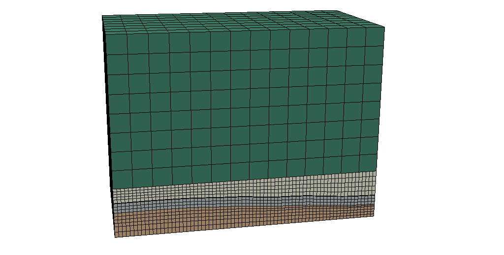
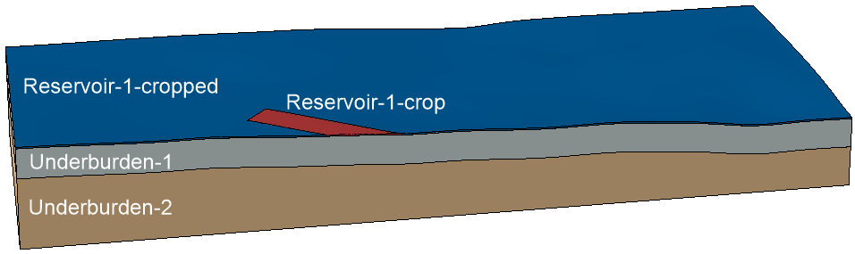
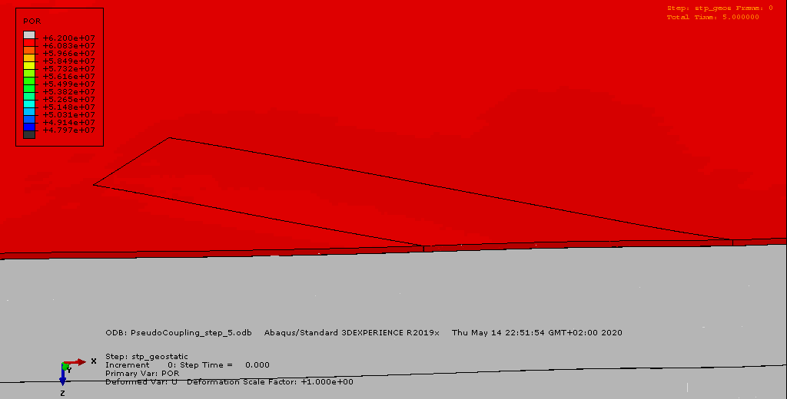
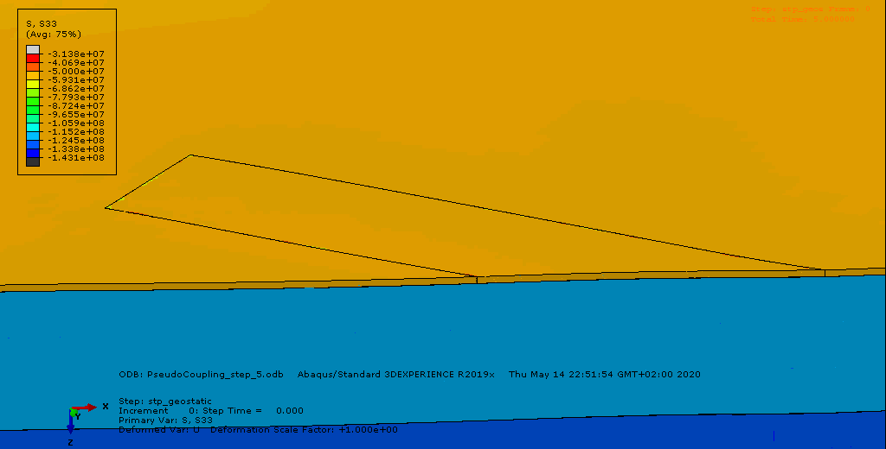

# Sample for a pseudo coupling


> This sample shows the use of this framework to set up a `pseudo coupling` in a more complex model, compared to [abaqus-self_2D_sample](abaqus-self_2d_sample). 
> Pore pressure boundary conditions of a `Simulia Abaqus Standard 3D` simulation are changed depending on an external function each iteration step.
> External function to change pore pressure values in this case, is a randomize function included in this framework.
> Due to the size of the model a ``scratch directory`` is used to store temporary files.
> It can be useful for test purposes, while developing a new engine for this framework. 

## Requirements

 - Simulia Abaqus Standard Engine

## Description/Usage

In this sample a 3d underground model is used.
The model is stored in the Simulia Abaqus input file ``input/abaqus_pseudo_coupling.inp``.
Edge length of the model is 7,200/3,800/5,350 (X/Y/Z) in meter.
The model is divided into six parts.
Only the parts ``Reservoir-1-cropped`` and ``Reservoir-1-crop`` are relevant in this case.




An initial pore pressure distribution for part ``Reservoir-1-crop`` is given by a constant value of 62,000,000 N/m² at each node.
(This can be done within Simulia Abaqus as well, then this section can be skipped in this sample.)
The initial pore pressure values are stored in the Grid object for the step named ``initial``.
Pore pressure boundary conditions will be set for part ``Reservoir-1-crop``.
Part ``Reservoir-1-cropped`` has a constant pore pressure of 62,000,000 N/m², which is a fixed boundary condition in all iteration steps.
An input file for Simulia Abaqus will be written and and stored in the specified output path ``output/step_initial/PseudoCoupling_initial.inp``.
A bash file for this iteration step's simulation is created and stored at the same place as the input file and will be run.
The Python's subprocess library calls the bash file and keeps the focus on the simulation until it ends.

In the upcoming four iteration steps the boundary conditions stored in the grid in the previous step will be changed by a gaussian randomize function ```GaussRandomizeGrid.get_random_data_set()```.
Therefore a new iteration step is initialized in the Simulation Handler object by copying the previous step.
The values for pore pressure of the previous step will be randomized.
This means that the simulation results itself are not taken into account in this simulation, which is a very low level type of a pseudo coupling.  

---

## Simulation Results

Here you can see a summary of the six iteration steps and changes in pore pressure, stress (z-direction) and displacement (z-direction) due to changing pore pressure boundary conditions.



Pore pressure changes due to modified boundary conditions (view on top of partition reservoir-1-crop/-cropped, cut in y-direction)



Stress (z-direction) changes due to modified pore pressure boundary conditions (view on top of partition reservoir-1-crop/-cropped, cut in y-direction)


Displacement (z-direction, + settlement, - heave) changes due to modified pore pressure boundary conditions (view on top of partition reservoir-1-crop/-cropped, cut in y-direction)

---

## Workflow


 1. Set root path
 2. Start logging
 3. Set simulation's name
 4. Initialize Simulation Handler object
 5. Add Engine Handler object to Simulation Handler object that cares about Abaqus engine.
 6. Set paths and files to Abaqus engine
 7. Set number of steps
 8. Set name of part to be modified
 9. Prepare first step: set step name; add step to Simulation Handler object; copy grid from Abaqus input file into Grid object; create initial boundary conditions for pore pressure with constant value and store in Grid object; create input file; create bash file;
 10. Run first iteration step of simulation
 11. Iterate through following steps: set step name; add step to Simulation Handler object; randomize pore pressure values in grid and store for new step; create boundary conditions for input file; create Abaqus input file; create bash file; run simulation step;

